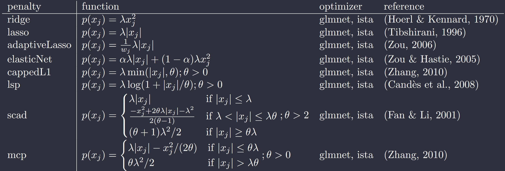

# lesspar

**lesspar** (**l**esspar **es**timates **s**parse **par**armeters or **Les**lie **s**nacks **par**ameters) is a C++ header-only library implemeting optimizers for functions of the form

$$g(\pmb\theta) = f(\pmb\theta) + p(\pmb\theta)$$

where $f(\pmb\theta)$ is (twice) continously differentiable with respect to $\theta$ and $p(\pmb\theta)$
is a non-differentiable penalty function (e.g., lasso or scad). Currently, the following penalty functions
are supported:

Two different optimization routines are implemented:

- glmnet: A quasi-newton optimization algorithm developed by Friedman et al. (2010) and Yuan et al. (2012). This optimzier 
uses the gradients and Hessian of the function $f(\pmb\theta)$.
- ista: A proximal-operator based optimzier adapted from Beck et al. (2009), Gong et al. (2013), and Parikh et al. (2013). This optimzier 
uses the gradients of the function $f(\pmb\theta)$.

**lesspar** was mainly developed to be used in [**lessSEM**](https://jhorzek.github.io/lessSEM/), an 
R package for regularized Structural Equation Models. However, the library can also be used from C++.
**lesspar** builds heavily on the **RcppAdmadillo** (Eddelbuettel et al., 2014) and **armadillo** (Sanderson et al., 2016) 
libraries. The optimizer interface is inspired by the **ensmallen** library (Curtin et al., 2021).

# References

## Software

- Curtin R R, Edel M, Prabhu R G, Basak S, Lou Z, Sanderson C (2021). The ensmallen library for flexible numerical optimization. Journal of Machine Learning Research, 22 (166).
- Eddelbuettel D, Sanderson C (2014). “RcppArmadillo: Accelerating R with high-performance C++ linear algebra.” Computational Statistics and Data Analysis, 71, 1054–1063. doi:10.1016/j.csda.2013.02.005.
- Sanderson C, Curtin R (2016). Armadillo: a template-based C++ library for linear algebra. Journal of Open Source Software, 1 (2), pp. 26.

## Penalty Functions

- Candès, E. J., Wakin, M. B., & Boyd, S. P. (2008). Enhancing Sparsity
  by Reweighted l1 Minimization. Journal of Fourier Analysis and
  Applications, 14(5–6), 877–905.
  <https://doi.org/10.1007/s00041-008-9045-x>
- Fan, J., & Li, R. (2001). Variable selection via nonconcave penalized
  likelihood and its oracle properties. Journal of the American
  Statistical Association, 96(456), 1348–1360.
  <https://doi.org/10.1198/016214501753382273>
- Hoerl, A. E., & Kennard, R. W. (1970). Ridge Regression: Biased
  Estimation for Nonorthogonal Problems. Technometrics, 12(1), 55–67.
  <https://doi.org/10.1080/00401706.1970.10488634>
- Tibshirani, R. (1996). Regression shrinkage and selection via the
  lasso. Journal of the Royal Statistical Society. Series B
  (Methodological), 58(1), 267–288.
- Zhang, C.-H. (2010). Nearly unbiased variable selection under minimax
  concave penalty. The Annals of Statistics, 38(2), 894–942.
  <https://doi.org/10.1214/09-AOS729>
- Zhang, T. (2010). Analysis of Multi-stage Convex Relaxation for Sparse
  Regularization. Journal of Machine Learning Research, 11, 1081–1107.
- Zou, H. (2006). The adaptive lasso and its oracle properties. Journal
  of the American Statistical Association, 101(476), 1418–1429.
  <https://doi.org/10.1198/016214506000000735>
- Zou, H., & Hastie, T. (2005). Regularization and variable selection
  via the elastic net. Journal of the Royal Statistical Society: Series
  B, 67(2), 301–320. <https://doi.org/10.1111/j.1467-9868.2005.00503.x>

## GLMNET

- Friedman, J., Hastie, T., & Tibshirani, R. (2010). Regularization paths for generalized linear models via coordinate descent. Journal of Statistical Software, 33(1), 1–20. https://doi.org/10.18637/jss.v033.i01
- Yuan, G.-X., Ho, C.-H., & Lin, C.-J. (2012). An improved GLMNET for l1-regularized logistic regression. The Journal of Machine Learning Research, 13, 1999–2030. https://doi.org/10.1145/2020408.2020421

## Variants of ISTA

- Beck, A., & Teboulle, M. (2009). A Fast Iterative Shrinkage-Thresholding Algorithm for Linear Inverse Problems. SIAM Journal on Imaging Sciences, 2(1), 183–202. https://doi.org/10.1137/080716542
- Gong, P., Zhang, C., Lu, Z., Huang, J., & Ye, J. (2013). A general iterative shrinkage and thresholding algorithm for non-convex regularized optimization problems. Proceedings of the 30th International Conference on Machine Learning, 28(2)(2), 37–45.
- Parikh, N., & Boyd, S. (2013). Proximal Algorithms. Foundations and Trends in Optimization, 1(3), 123–231.

